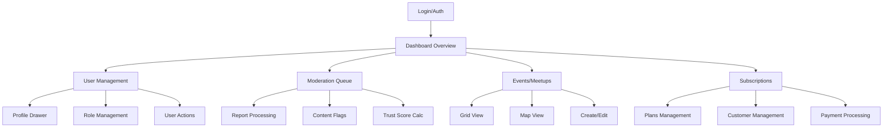

# MeetNest Admin Dashboard - Product Requirements Document

## 1. Product Overview

MeetNest Admin Dashboard is a comprehensive administrative interface for managing the MeetNest social travel platform, enabling administrators and moderators to oversee users, events, meetups, subscriptions, and content moderation with real-time analytics and robust security controls.

The dashboard addresses the critical need for efficient platform management, user safety oversight, and business intelligence for a growing social travel community, providing administrators with powerful tools to maintain platform quality and user engagement.

This enterprise-grade solution targets platform administrators and content moderators, delivering significant operational efficiency and enhanced user safety through automated workflows and comprehensive audit trails.

## 2. Core Features

### 2.1 User Roles

| Role | Registration Method | Core Permissions |
|------|---------------------|------------------|
| Admin | System invitation only | Full access: user management, role changes, plan management, moderation actions, system configuration |
| Moderator | Admin invitation with role assignment | Content moderation, report processing, user suspension (limited), flag management |
| Regular User | Not applicable (dashboard access restricted) | No dashboard access |

### 2.2 Feature Module

Our MeetNest Admin Dashboard consists of the following essential pages:

1. **Dashboard**: KPI overview cards, analytics charts, real-time metrics, date range filters
2. **User Management**: User data grid, profile management, role assignment, trust score management, user blocking
3. **Subscriptions & Plans**: Plan configuration, customer subscription management, payment processing, promo code redemption
4. **Events Management**: Event grid/map view, event creation/editing, attendee management, location-based filtering
5. **Meetups (Hangouts)**: Meetup grid/map interface, creation tools, participant management, active/past categorization
6. **Moderation & Safety**: Report queue management, content flag processing, moderation actions, trust score calculation
7. **Messaging Oversight**: Chat monitoring, message review, communication audit trails
8. **Notifications System**: Push token management, notification broadcasting, system alerts
9. **Catalog Management**: Interest categories, language settings, gender options, taxonomy management

### 2.3 Page Details

| Page Name | Module Name | Feature description |
|-----------|-------------|---------------------|
| Dashboard | KPI Cards | Display new users, active users, paid users, churned subscriptions, meetups/events created, attendees, reports (7/30 day filters) |
| Dashboard | Analytics Charts | Render interactive charts with server-side date filtering, UTC timezone handling, trend visualization |
| User Management | User Data Grid | Server-side paginated table with avatar, display_name, email, role, status, trust_score, created_at columns |
| User Management | User Filters | Filter by role, status, trust_score range, date range, city/country with real-time search |
| User Management | User Actions | View profile drawer, edit core fields, change roles, suspend/ban status toggle, recalculate trust scores, manage user blocks |
| User Management | Profile Drawer | Display/edit preferences via RPC, manage photos, languages/interests, relationship status, subscription details |
| Subscriptions | Plans Management | CRUD operations for subscription plans (name, interval, price_cents, currency), plan activation/deactivation |
| Subscriptions | Customer Management | View subscription details with plan joins, status tracking, upgrade/downgrade actions, payment recording, promo redemption |
| Events | Event Grid/Map | Toggle between grid and map views, display title, dates, location, participants, creator with server-side pagination |
| Events | Event Management | Create/edit events via RPC, auto-attendee addition, chat creation, attendee management, detail panels |
| Events | Location Filtering | Map bounds filtering using get_events_in_bounds RPC, geographic search capabilities |
| Meetups | Meetup Grid/Map | Similar to events with emoticon, female_only flags, expiration handling, participant management |
| Meetups | Meetup Creation | Create meetups with security definer RPC, manage active/past categorization, participant oversight |
| Moderation | Reports Queue | Process user_reports with status workflow (pending→reviewed→resolved), batch actions, detailed report drawers |
| Moderation | Moderation Actions | Issue warnings, suspend/ban users, log actions, trust score recalculation with delta display |
| Moderation | Content Flags | Review content_flags by type (profile/message/bio/photo), approve/remove workflow |
| Messaging | Chat Oversight | Searchable chat list with activity metrics, read-only message viewer, author profile integration |
| Notifications | Push Management | Manage user_push_tokens by platform, send test notifications, view notification history |
| Catalog | Taxonomy Management | Manage interests with categories/emoticons, languages, genders with safety validation |

## 3. Core Process

**Admin Workflow:**
Administrators log in through Supabase authentication, access the dashboard overview with key metrics, navigate to user management for profile oversight and role assignments, process moderation reports and content flags, manage subscription plans and customer billing, oversee events and meetups with geographic filtering, monitor messaging for safety compliance, and configure system catalogs and notifications.

**Moderator Workflow:**
Moderators authenticate with limited permissions, focus on the moderation queue for report processing, review and action content flags, monitor user communications for policy violations, calculate and adjust user trust scores, and log all moderation actions for audit compliance.

## 4. User Interface Design

### 4.1 Design Style

- **Primary Colors**: Deep blue (#1976D2) for primary actions, dark gray (#424242) for backgrounds
- **Secondary Colors**: Orange (#FF9800) for warnings, green (#4CAF50) for success, red (#F44336) for errors
- **Button Style**: Material Design rounded buttons with subtle shadows and hover animations
- **Font**: Roboto family with 14px base size, 16px for headers, 12px for metadata
- **Layout Style**: Card-based design with top navigation, sidebar for feature areas, responsive grid system
- **Icons**: Material Design icons with consistent 24px sizing, contextual color coding

### 4.2 Page Design Overview

| Page Name | Module Name | UI Elements |
|-----------|-------------|-------------|
| Dashboard | KPI Cards | Material cards with metric values, trend indicators, color-coded status, 7/30 day toggle buttons |
| Dashboard | Charts Section | Chart.js integration with dark theme support, date range pickers, responsive containers |
| User Management | Data Grid | Angular Material table with sorting, filtering, pagination controls, action buttons per row |
| User Management | Profile Drawer | Slide-out panel with tabbed sections, form controls, image galleries, preference toggles |
| Events/Meetups | Grid/Map Toggle | Tab-based interface with Material toggle buttons, responsive map container, overlay controls |
| Moderation | Report Queue | Priority-coded list items, status badges, expandable detail sections, batch action toolbar |
| Subscriptions | Plans Table | Editable data grid with inline forms, currency formatting, status indicators |

### 4.3 Responsiveness

Desktop-first responsive design with mobile-adaptive breakpoints at 768px and 1024px. Touch interaction optimization for mobile moderation workflows, collapsible sidebar navigation, and responsive data tables with horizontal scrolling on smaller screens.