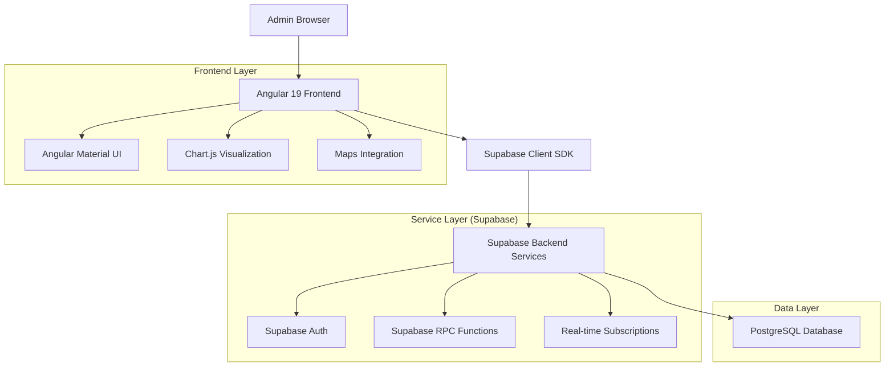
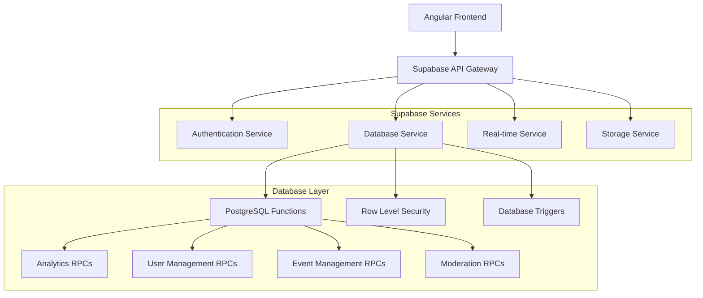
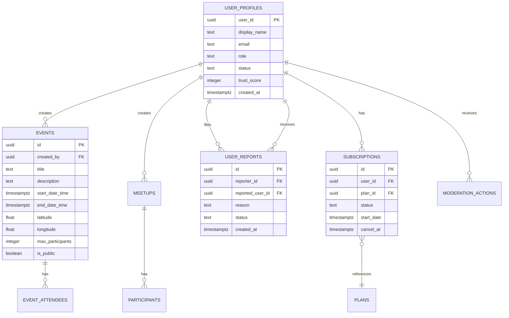

# MeetNest Admin Dashboard - Technical Architecture Document

## 1. Architecture Design



## 2. Technology Description

* **Frontend**: Angular\@19 + Angular Material\@19 + Chart.js\@4 + Leaflet/Google Maps + RxJS\@7

* **Backend**: Supabase (PostgreSQL + Auth + Real-time + Storage)

* **State Management**: Angular Signals + light NgRx for complex flows

* **Build Tool**: Angular CLI\@19 with Vite integration

* **Styling**: Angular Material + Custom SCSS with dark mode support

## 3. Route Definitions

| Route          | Purpose                                                       |
| -------------- | ------------------------------------------------------------- |
| /auth          | Authentication page with Supabase auth integration            |
| /dashboard     | Main dashboard with KPI cards and analytics charts            |
| /users         | User management grid with profile drawers and role management |
| /subscriptions | Subscription plans and customer management interface          |
| /events        | Events management with grid/map toggle and creation tools     |
| /meetups       | Meetups (hangouts) management with participant oversight      |
| /moderation    | Safety and moderation queue with report processing            |
| /messaging     | Chat oversight and communication monitoring                   |
| /notifications | Push notification management and system alerts                |
| /catalog       | Taxonomy management for interests, languages, and categories  |

## 4. API Definitions

### 4.1 Core API

**Authentication & Authorization**

```typescript
// Supabase Auth Integration
supabase.auth.signInWithPassword({ email, password })
supabase.auth.getUser()
supabase.auth.signOut()
```

**User Management RPCs**

```typescript
// Get user profile with admin context
supabase.rpc('get_user_profile', { uid: string, admin_uid: string })

// Update user preferences
supabase.rpc('update_user_preferences', { 
  user_id: string, 
  preferences: UserPreferences 
})

// Calculate trust score
supabase.rpc('calculate_user_trust_score', { user_id: string })
```

**Analytics RPCs**

```typescript
// Get dashboard analytics
supabase.rpc('get_analytics_overview', { 
  date_range: 'week' | 'month', 
  start_date?: string, 
  end_date?: string 
})

// Export analytics data
supabase.rpc('export_analytics_data', { 
  export_format: 'json' | 'csv', 
  data_type: 'overview' | 'users' | 'revenue' 
})
```

**Event Management RPCs**

```typescript
// Create event with auto-attendee and chat
supabase.rpc('create_event', {
  title: string,
  description: string,
  start_date_time: string,
  end_date_time: string,
  latitude: number,
  longitude: number,
  max_participants: number,
  is_public: boolean
})

// Get events within geographic bounds
supabase.rpc('get_events_in_bounds', {
  admin_uid: string,
  min_lat: number,
  max_lat: number,
  min_lng: number,
  max_lng: number
})
```

**Subscription Management RPCs**

```typescript
// Upgrade user to pro plan
supabase.rpc('upgrade_to_pro_plan', { 
  user_id: string, 
  plan_id: string 
})

// Record subscription payment
supabase.rpc('record_subscription_payment', {
  subscription_id: string,
  amount_cents: number,
  currency: string,
  provider_payment_id: string
})

// Redeem promo code
supabase.rpc('redeem_promo_code', { 
  code: string, 
  user_id: string 
})
```

**Moderation RPCs**

```typescript
// Get chat screen for admin review
supabase.rpc('get_chat_screen', { 
  chat_id: string, 
  admin_user_id: string 
})

// Process moderation action
supabase.rpc('create_moderation_action', {
  user_id: string,
  action_type: 'warning' | 'suspension' | 'ban',
  reason: string,
  admin_id: string
})
```

### 4.2 Data Types

```typescript
interface UserProfile {
  user_id: string;
  display_name: string;
  email: string;
  role: 'user' | 'admin' | 'moderator';
  status: 'active' | 'suspended' | 'banned';
  trust_score: number;
  created_at: string;
  current_city?: string;
  current_country?: string;
}

interface AnalyticsOverview {
  total_users: number;
  active_users: number;
  total_revenue: number;
  total_subscriptions: number;
  growth_rate: number;
  churn_rate: number;
}

interface Event {
  id: string;
  title: string;
  description: string;
  created_by: string;
  start_date_time: string;
  end_date_time: string;
  latitude: number;
  longitude: number;
  max_participants: number;
  is_public: boolean;
  attendee_count: number;
}

interface UserReport {
  id: string;
  reporter_id: string;
  reported_user_id: string;
  reason: string;
  details: string;
  status: 'pending' | 'reviewed' | 'resolved' | 'dismissed';
  created_at: string;
}
```

## 5. Server Architecture Diagram



## 6. Data Model

### 6.1 Data Model Definition



### 6.2 Data Definition Language

**Core Tables**

```sql
-- User profiles with role-based access
CREATE TABLE user_profiles (
    user_id uuid PRIMARY KEY REFERENCES auth.users(id) ON DELETE CASCADE,
    display_name text,
    email text UNIQUE,
    role text DEFAULT 'user' CHECK (role IN ('user', 'admin', 'moderator')),
    status text DEFAULT 'active' CHECK (status IN ('active', 'suspended', 'banned')),
    trust_score integer DEFAULT 100 CHECK (trust_score >= 0 AND trust_score <= 100),
    current_city text,
    current_country text,
    created_at timestamptz DEFAULT NOW()
);

-- Events with geographic data
CREATE TABLE events (
    id uuid PRIMARY KEY DEFAULT gen_random_uuid(),
    created_by uuid REFERENCES user_profiles(user_id) ON DELETE SET NULL,
    title text NOT NULL,
    description text,
    start_date_time timestamptz NOT NULL,
    end_date_time timestamptz,
    latitude double precision NOT NULL,
    longitude double precision NOT NULL,
    max_participants integer,
    is_public boolean DEFAULT true,
    created_at timestamptz DEFAULT NOW()
);

-- Subscription plans and management
CREATE TABLE plans (
    id uuid PRIMARY KEY DEFAULT gen_random_uuid(),
    name text NOT NULL,
    interval text CHECK (interval IN ('week', 'month', '3_months')),
    price_cents integer NOT NULL,
    currency text DEFAULT 'ZAR',
    active boolean DEFAULT true,
    created_at timestamptz DEFAULT NOW()
);

CREATE TABLE subscriptions (
    id uuid PRIMARY KEY DEFAULT gen_random_uuid(),
    user_id uuid REFERENCES user_profiles(user_id) ON DELETE CASCADE,
    plan_id uuid REFERENCES plans(id),
    status text CHECK (status IN ('active', 'past_due', 'canceled', 'trialing', 'non_renewing')),
    start_date timestamptz DEFAULT NOW(),
    cancel_at timestamptz,
    provider_subscription_id text,
    UNIQUE(user_id) -- One active subscription per user
);

-- Moderation and safety
CREATE TABLE user_reports (
    id uuid PRIMARY KEY DEFAULT gen_random_uuid(),
    reporter_id uuid REFERENCES user_profiles(user_id) ON DELETE CASCADE,
    reported_user_id uuid REFERENCES user_profiles(user_id) ON DELETE CASCADE,
    reason text NOT NULL,
    details text,
    status text DEFAULT 'pending' CHECK (status IN ('pending', 'reviewed', 'resolved', 'dismissed', 'action_taken')),
    created_at timestamptz DEFAULT NOW()
);

CREATE TABLE moderation_actions (
    id uuid PRIMARY KEY DEFAULT gen_random_uuid(),
    user_id uuid REFERENCES user_profiles(user_id) ON DELETE CASCADE,
    admin_id uuid REFERENCES user_profiles(user_id) ON DELETE SET NULL,
    action_type text NOT NULL,
    reason text,
    created_at timestamptz DEFAULT NOW()
);
```

**Indexes for Performance**

```sql
-- User management indexes
CREATE INDEX idx_user_profiles_role ON user_profiles(role);
CREATE INDEX idx_user_profiles_status ON user_profiles(status);
CREATE INDEX idx_user_profiles_trust_score ON user_profiles(trust_score);
CREATE INDEX idx_user_profiles_created_at ON user_profiles(created_at DESC);

-- Event management indexes
CREATE INDEX idx_events_created_by ON events(created_by);
CREATE INDEX idx_events_start_date ON events(start_date_time);
CREATE INDEX idx_events_location ON events(latitude, longitude);

-- Subscription indexes
CREATE INDEX idx_subscriptions_user_id ON subscriptions(user_id);
CREATE INDEX idx_subscriptions_status ON subscriptions(status);
CREATE INDEX idx_subscriptions_start_date ON subscriptions(start_date DESC);

-- Moderation indexes
CREATE INDEX idx_user_reports_status ON user_reports(status);
CREATE INDEX idx_user_reports_created_at ON user_reports(created_at DESC);
CREATE INDEX idx_moderation_actions_user_id ON moderation_actions(user_id);
```

**Row Level Security Policies**

```sql
-- Admin and moderator access to user profiles
CREATE POLICY "Admin full access to user_profiles" ON user_profiles
    FOR ALL USING (
        EXISTS (
            SELECT 1 FROM user_profiles up 
            WHERE up.user_id = auth.uid() 
            AND up.role IN ('admin', 'moderator')
        )
    );

-- Admin-only access to subscription management
CREATE POLICY "Admin access to subscriptions" ON subscriptions
    FOR ALL USING (
        EXISTS (
            SELECT 1 FROM user_profiles up 
            WHERE up.user_id = auth.uid() 
            AND up.role = 'admin'
        )
    );
```

